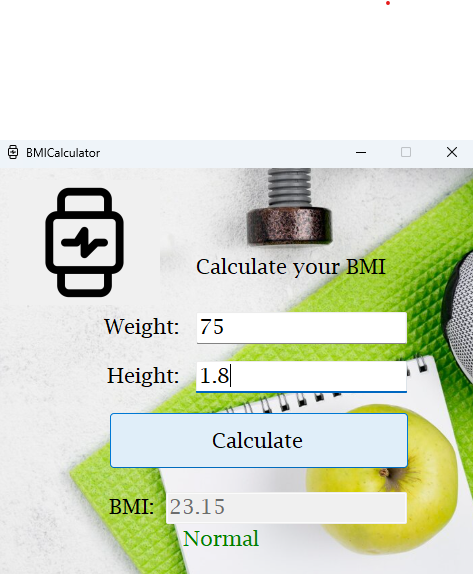

# BMI Calculator (WinForms)

A simple and interactive **Windows Forms Application** that calculates the Body Mass Index (BMI).  
This project was built with **C# and .NET Framework (WinForms)** and provides a clean and user-friendly interface for quickly checking BMI values.

---

## 📌 Overview

The **BMI Calculator** allows the user to enter their **weight** (in kilograms) and **height** (in meters).  
After clicking the **Calculate** button, the application displays:

- The **calculated BMI value** (with two decimal places).  
- The **health classification** based on the BMI result.  
- Validation to prevent invalid input (only numbers and decimal separator are allowed).  

This makes it a practical tool for educational purposes, personal use, or as a starting project for learning **C# WinForms** development.

---

## 🖼️ Screenshot

Here is an example of the application running:

---

## ⚙️ How It Works

1. Enter your **weight** in kilograms (e.g., `75`).  
2. Enter your **height** in meters (e.g., `1.80`).  
3. Click the **Calculate** button.  
4. The application computes the BMI using the formula:
